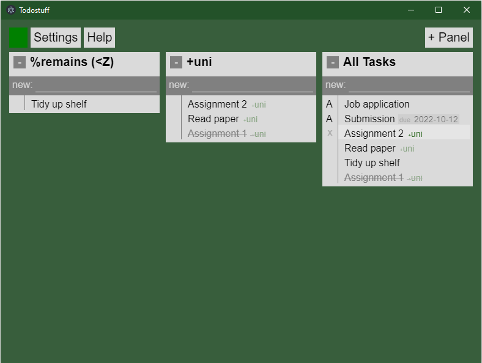
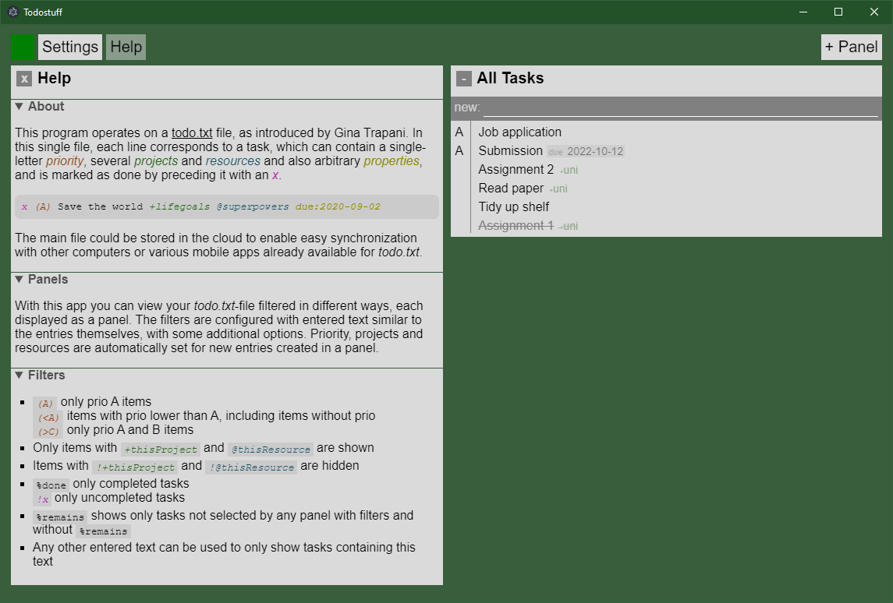

# todostuff

A simple, column-based frontend for the [todo.txt](http://todotxt.org/) format. Each column can be defined as a set of filters based on categories, resources, priorities, and more. Adding items in the column automatically adds all those properties, allowing for variable concepts of organization.

This is a personal work in progress and has not been tested on different devices but I'm always open to suggestions and issues.

